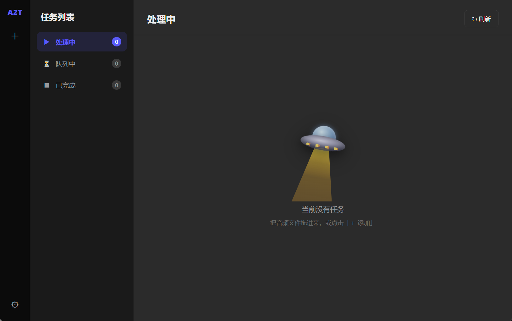
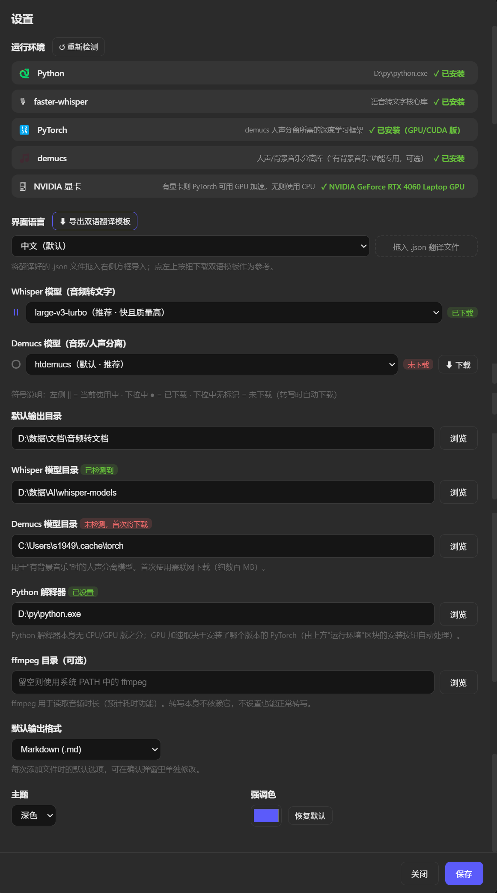
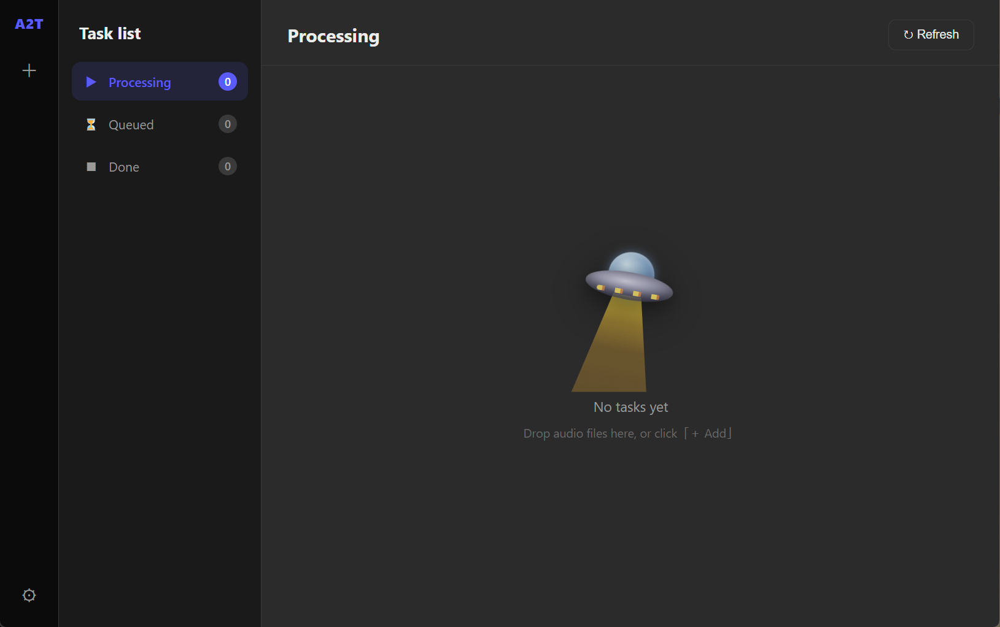
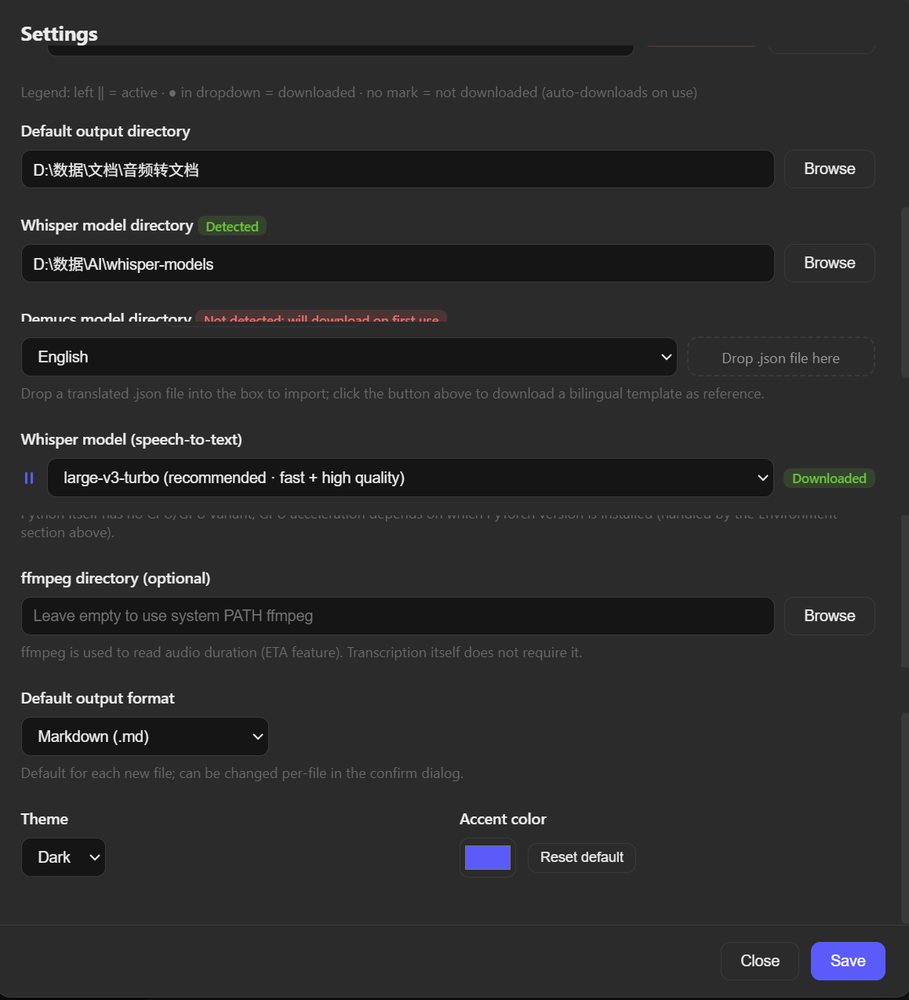

# Audio2Text

[中文](#中文) · [English](#english)

---

<a id="中文"></a>

## 中文

**本地 Whisper 语音转文字桌面工具**

> 零 API 费用 · 完全本地运行 · 隐私安全 · 支持多语言界面

<p align="center">
  
  &nbsp;
  
</p>

### 功能特点

- 🎙 **本地转写**：基于 faster-whisper，完全离线，不消耗任何 API token
- 🎵 **人声分离**：可选 demucs，自动分离背景音乐后再转写
- 📂 **批量处理**：拖拽文件或批量添加，支持任务队列
- ⚡ **GPU 加速**：自动检测 NVIDIA GPU，支持 CUDA 加速
- 🔍 **环境自检**：启动时自动检测所有依赖，缺什么提示装什么（含一键安装+实时进度）
- 🌐 **多语言界面**：内置中文/英文，支持拖入自定义 JSON 翻译包
- 📋 **多格式输出**：Markdown / 纯文本 / SRT 字幕 / VTT 字幕
- 🎨 **主题定制**：深色/浅色，可自定义强调色

### 支持的模型

**Whisper 语音识别模型**

| 模型 | 说明 | 显存需求 |
|------|------|---------|
| `large-v3-turbo` | ⭐ 推荐，速度与质量均衡 | ~3 GB |
| `large-v3` | 最高质量，较慢 | ~6 GB |
| `large-v2` | 经典稳定版 | ~6 GB |
| `distil-large-v3` | 蒸馏版，接近 large 质量，更快 | ~3 GB |
| `medium` | 中等质量，可 CPU 使用 | ~2 GB |
| `small` | 轻量，CPU 友好 | ~1 GB |
| `base` | 极轻，CPU 友好 | ~0.5 GB |
| `tiny` | 最轻最快，精度较低 | ~0.3 GB |

模型首次使用时自动从 HuggingFace 下载。

**Demucs 人声分离模型**

| 模型 | 说明 |
|------|------|
| `htdemucs` | ⭐ 默认推荐 |
| `htdemucs_ft` | 更高质量，慢约 4 倍 |
| `htdemucs_6s` | 分离 6 个声部 |
| `mdx_extra` | MDX 架构备选 |
| `mdx_extra_q` / `mdx_q` | 量化版，CPU 友好 |

### 快速开始

**1. 下载**：前往 [Releases](../../releases/latest) 下载 `Audio2Text.exe`（便携版，无需安装）

**2. 安装 Python**：需要 Python 3.9+：https://python.org（勾选 "Add Python to PATH"）

> 计划在未来版本中内嵌 Python 运行时，届时将无需此步骤。

**3. 运行**：双击 `Audio2Text.exe`，打开 **设置 → 运行环境**，应用自动检测并一键安装所需的 Python 依赖（faster-whisper、demucs 等）。

### 项目结构

```
audio2text/
├── main.js              # Electron 主进程（窗口、IPC、任务队列、模型检测）
├── preload.js           # 预加载脚本（安全桥接主进程与渲染进程）
├── renderer/
│   ├── index.html       # 主界面 HTML
│   ├── app.js           # 界面逻辑（任务管理、设置、动画）
│   ├── style.css        # 样式
│   └── strings.js       # i18n 字符串（所有用户可见文字集中于此）
├── backend/
│   └── pipeline.py      # Python 推理管道（Whisper 转写 + Demucs 分离）
├── locales/
│   └── English.json     # 英文翻译包（内置）
└── docs/                # 截图
```

**架构**：Electron 主进程管理任务调度与子进程；渲染进程（Chromium）负责 UI；Python 作为外部子进程运行，通过 stdout/stdin 行协议与主进程通信。

### 技术栈

| 组件 | 用途 | License |
|------|------|---------|
| [Electron](https://electronjs.org) 33.x | 桌面应用框架 | MIT |
| [faster-whisper](https://github.com/SYSTRAN/faster-whisper) | 基于 CTranslate2 的高效 Whisper 推理 | MIT |
| [CTranslate2](https://github.com/OpenNMT/CTranslate2) | 高性能 Transformer 推理引擎 | MIT |
| [demucs](https://github.com/facebookresearch/demucs) | 音乐/人声分离 | MIT |
| [OpenAI Whisper](https://github.com/openai/whisper) | 原始 ASR 模型权重 | MIT |
| [PyTorch](https://pytorch.org) | demucs 深度学习框架（可选 CUDA） | BSD-3 |
| Python 3.9+ | 后端推理运行时 | PSF |

UI 界面采用深色、硬边、等宽字体的构成主义视觉风格；[Motrix](https://github.com/agalwood/Motrix) 在双栏布局结构上提供了参考。

### 国际化

**贡献翻译**：

1. 设置 → 界面语言 → **"导出双语翻译模板"**
2. 编辑 JSON，将英文值替换为目标语言（`_` 开头的行是说明，导入时忽略）
3. 拖入设置中的翻译区域，或通过 PR 提交到 `locales/` 目录

### 开发

```bash
git clone https://github.com/Svur42/audio2text.git
cd audio2text && npm install
npm start        # 开发模式
npm run build    # 打包 Windows portable exe
```

### License

[GNU General Public License v3.0](LICENSE)

### 致谢

- [@Svur42](https://github.com/Svur42) — 项目发起人与主要开发者
- [Claude](https://anthropic.com) (Anthropic) — AI 编程协作

---

<a id="english"></a>

## English

**Local Whisper Speech-to-Text Desktop App**

> Zero API cost · Fully local · Privacy-first · Multi-language UI

<p align="center">
  
  &nbsp;
  
</p>

### Features

- 🎙 **Local transcription**: Powered by faster-whisper, fully offline, zero API tokens
- 🎵 **Vocal separation**: Optional demucs to separate background music before transcribing
- 📂 **Batch processing**: Drag & drop or batch add files with task queue
- ⚡ **GPU acceleration**: Auto-detects NVIDIA GPU, supports CUDA
- 🔍 **Environment check**: Detects missing dependencies on startup, one-click install with progress
- 🌐 **Multi-language UI**: Built-in Chinese/English, import custom JSON translation packs
- 📋 **Multiple output formats**: Markdown / Plain text / SRT / VTT subtitles
- 🎨 **Theme customization**: Dark/light mode, custom accent color

### Supported Models

**Whisper Speech Recognition**

| Model | Description | VRAM |
|-------|-------------|------|
| `large-v3-turbo` | ⭐ Recommended — balanced speed & quality | ~3 GB |
| `large-v3` | Highest quality, slower | ~6 GB |
| `large-v2` | Classic stable version | ~6 GB |
| `distil-large-v3` | Distilled, near-large quality, faster | ~3 GB |
| `medium` | Moderate quality, works on CPU | ~2 GB |
| `small` | Lightweight, CPU-friendly | ~1 GB |
| `base` | Very light, CPU-friendly | ~0.5 GB |
| `tiny` | Lightest & fastest, lower accuracy | ~0.3 GB |

Models are downloaded automatically from HuggingFace on first use.

**Demucs Vocal Separation**

| Model | Description |
|-------|-------------|
| `htdemucs` | ⭐ Default, recommended |
| `htdemucs_ft` | Better quality, ~4× slower |
| `htdemucs_6s` | 6-stem separation |
| `mdx_extra` | MDX architecture alternative |
| `mdx_extra_q` / `mdx_q` | Quantized, CPU-friendly |

### Quick Start

**1. Download**: Get `Audio2Text.exe` from [Releases](../../releases/latest) (portable, no install needed)

**2. Install Python**: Requires Python 3.9+: https://python.org (check "Add Python to PATH")

> A future version will bundle the Python runtime, removing this step entirely.

**3. Run**: Double-click `Audio2Text.exe`. Open **Settings → Environment** — the app detects missing dependencies and installs them in one click (faster-whisper, demucs, etc.).

### Project Structure

```
audio2text/
├── main.js              # Electron main process (window, IPC, task queue)
├── preload.js           # Preload script (secure IPC bridge)
├── renderer/
│   ├── index.html       # Main UI
│   ├── app.js           # UI logic (tasks, settings, animations)
│   ├── style.css        # Styles
│   └── strings.js       # i18n strings (all user-visible text)
├── backend/
│   └── pipeline.py      # Python inference pipeline (Whisper + Demucs)
├── locales/
│   └── English.json     # English translation (built-in)
└── docs/                # Screenshots
```

**Architecture**: Electron main process handles task scheduling and subprocess management; renderer (Chromium) handles UI via `contextBridge`; Python runs as an external subprocess communicating via stdout/stdin line protocol.

### Tech Stack

| Component | Role | License |
|-----------|------|---------|
| [Electron](https://electronjs.org) 33.x | Desktop app framework | MIT |
| [faster-whisper](https://github.com/SYSTRAN/faster-whisper) | Efficient Whisper inference via CTranslate2 | MIT |
| [CTranslate2](https://github.com/OpenNMT/CTranslate2) | High-performance Transformer inference engine | MIT |
| [demucs](https://github.com/facebookresearch/demucs) | Music/vocal source separation | MIT |
| [OpenAI Whisper](https://github.com/openai/whisper) | Original ASR model weights | MIT |
| [PyTorch](https://pytorch.org) | Deep learning framework for demucs (optional CUDA) | BSD-3 |
| Python 3.9+ | Backend inference runtime | PSF |

UI uses a constructivist visual style — dark tones, hard edges, monospace typography. Layout structure references [Motrix](https://github.com/agalwood/Motrix).

### Internationalization

**Contributing a translation:**

1. Settings → Interface language → **"Export bilingual template"**
2. Edit the JSON, replace English values with your translation (`_` lines are notes, ignored on import)
3. Drag into the Settings translation zone, or submit a PR to `locales/`

### Development

```bash
git clone https://github.com/Svur42/audio2text.git
cd audio2text && npm install
npm start        # Development mode
npm run build    # Build Windows portable exe
```

### License

[GNU General Public License v3.0](LICENSE)

### Credits

- [@Svur42](https://github.com/Svur42) — Project creator & lead developer
- [Claude](https://anthropic.com) (Anthropic) — AI programming assistant
